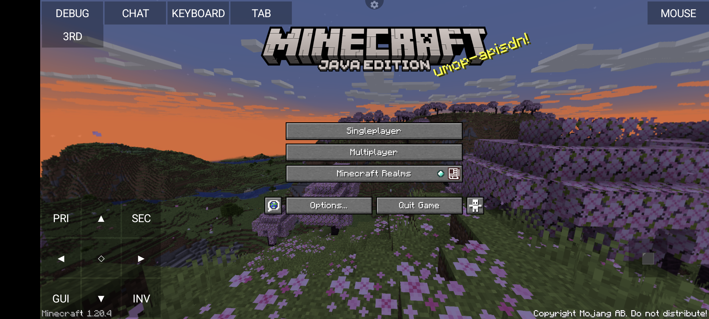

# Taking a look at the controls

When you load into the game, you will see a control scheme like this:

The controls are very similar to MCPE's old controls. (without the joystick)

Lets go over the Controls:
⯅/⯆/⯇/⯈ - Movement
⬦ - Sneak
⬛ - Jump
PRI - PRImary click
SEC - SECondary click
GUI - Hide Gui
INV - Open INVentory
DEBUG - Opens the debug/F3 menu
CHAT - Opens the chat
KEYBOARD - Opens the keyboard (for chat or naming a world)
TAB - Presses tab (what did you expect)
3RD - Toggle perspective
MOUSE - Hides/Shows the virtual mouse (Drag to move, tap to click, hides automatically when in game)

You can edit these controls at any time using the [custom controls editor](CUSTOM-CONTROLS.md)
