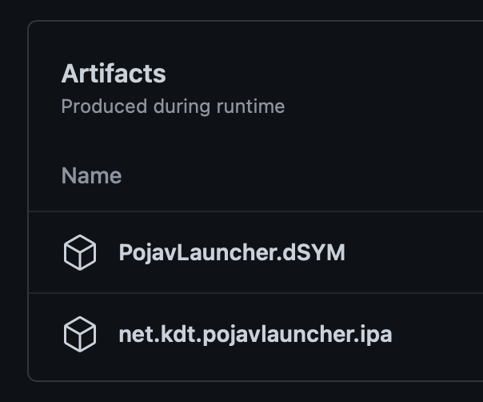

# Installing the launcher

## Android
Instructions for installing PojavLauncher on Android devices.

::: details Google Play
You can grab PojavLauncher from the Google Play Store [here.](https://play.google.com/store/apps/details?id=net.kdt.pojavlaunch)
:::

::: details GitHub Actions
**Requires a GitHub account in order to download.**

If you want the latest and greatest to test before the official release, you can grab a copy from GitHub Actions.

1. Start off by heading to the [PojavLauncher](https://github.com/PojavLauncherTeam/PojavLauncher) repository and switching to the "Actions" tab.

2. Next, select "Android CI" in the workflow selection menu.

3. Choose a build with a green or blue checkmark next to the branch you want to download.
    - `v3_openjdk` will be the one for most people.

4. Under "Artifacts", choose the build type you wish to download.
    - `app-debug` will be the one for most people.

Once you have an Actions build downloaded, you can now unzip the file and install it as you would any other .apk file.
:::

::: details Source
**Instructions coming in a future revision to this website.**
:::

## iOS
Instructions for installing PojavLauncher on Apple devices.

::: details Sideloading (TrollStore)
We recommend TrollStore for all users if possible. This method allows for automatic JIT enabling, more memory allocation, and non-revoking installs.

### TrollStore compatibility depends on whether your iDevice is arm64 (A8-A11) or arm64e (A12+/M1+)

   #### For arm64, TrollStore is compatible with the following iOS versions:
  
    - 14.0 to 14.8.1
    - 15.0 to 15.8
    - 16.0 to 16.6.1
    - 17.0
  
   #### For arm64e, TrollStore is compatible with the following iOS versions:
  
    - 14.0 to 14.8.1
    - 15.0 to 15.7.1
    - 16.0 to 16.5
    - 16.5.1 (*)
    - 16.6 beta 1
    - 16.6 beta 2 to 16.6.1 (*)
    - 17.0 (*)

	(*) - No Installation Method.

1. Follow the steps to install [TrollStore](https://github.com/opa334/TrollStore).
 
2. Download the latest release from [here](https://github.com/PojavLauncherTeam/PojavLauncher_iOS/releases/latest/download/net.kdt.pojavlauncher.ipa).
    - For a specific release, you can find its package on the [Releases](https://github.com/PojavLauncherTeam/PojavLauncher_iOS/releases) page

3. Locate where the .ipa was downloaded, tap the Share icon, and choose TrollStore in the list of options available.

You can now enjoy Minecraft: Java Edition on your iDevice!
:::

::: details Sideloading (Unjailbroken)
**Requires an active Apple ID, that has signed into the [Developer Portal](https://developer.apple.com/account) at least once.**

PojavLauncher supports being sideloaded with AltStore, Sideloadly, and Xcode. Instructions to use AltStore are below--for other options, refer to their documentation.

1. Follow the official guide on installing AltStore itself:
    - Instructions for [Mac](https://faq.altstore.io/getting-started/how-to-install-altstore-macos) and [Windows](https://faq.altstore.io/getting-started/how-to-install-altstore-windows)
    
2. Install the latest release using this [Install with AltStore](altstore://install?url=https://github.com/PojavLauncherTeam/PojavLauncher_iOS/releases/latest/download/net.kdt.pojavlauncher.ipa) button.
    - For a specific release, you can find its button on the [Releases](https://github.com/PojavLauncherTeam/PojavLauncher_iOS/releases) page

Installing PojavLauncher is not the end for iOS devices. In order to play Minecraft itself, you will need to [enable JIT](./JIT.md).
:::

::: details Sideloading (Jailbroken)
**Currently, AppSync Unified is not supported.** There is an [issue](https://github.com/akemin-dayo/AppSync/issues/108) regarding the data directory when installed with AppSync.

You can follow the `Sideloading (TrollStore)` or `Sideloading (Unjailbroken)` steps to sideload on a jailbroken iDevice. Regardless of the method, you will benefit from automatic JIT enabling and more memory allocation.
:::

::: details GitHub Actions
**Requires a GitHub account in order to download.**

If you want the latest and greatest to test before the official release, you can grab a copy from GitHub Actions.

1. Start off by heading to the [PojavLauncher iOS](https://github.com/PojavLauncherTeam/PojavLauncher_iOS) repository and switching to the "Actions" tab.

2. Next, select "Development Build" in the workflow selection menu.

3. Choose a build with a green or blue checkmark next to the branch you want to download.
    - `main` will be the one for most people.

4. Under "Artifacts", choose `net.kdt.pojavlauncher.ipa`

Once you have an Actions build downloaded, you can now unzip the file and use this .ipa for TrollStore or sideloading.
:::

::: details Source
**Instructions coming in a future revision to this website.**
:::
