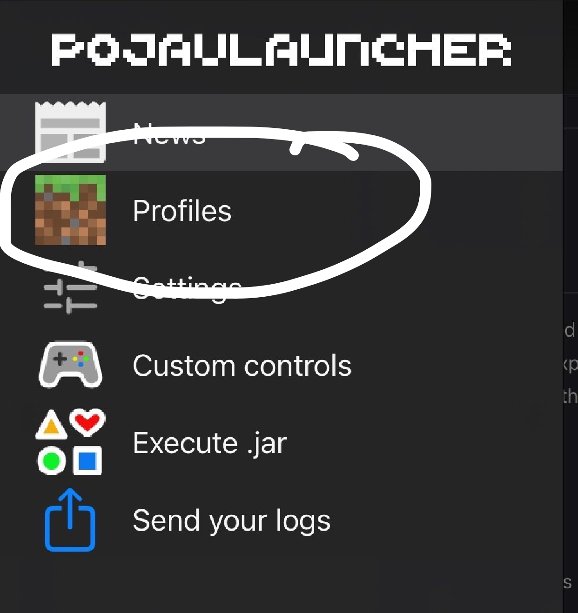
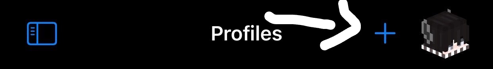
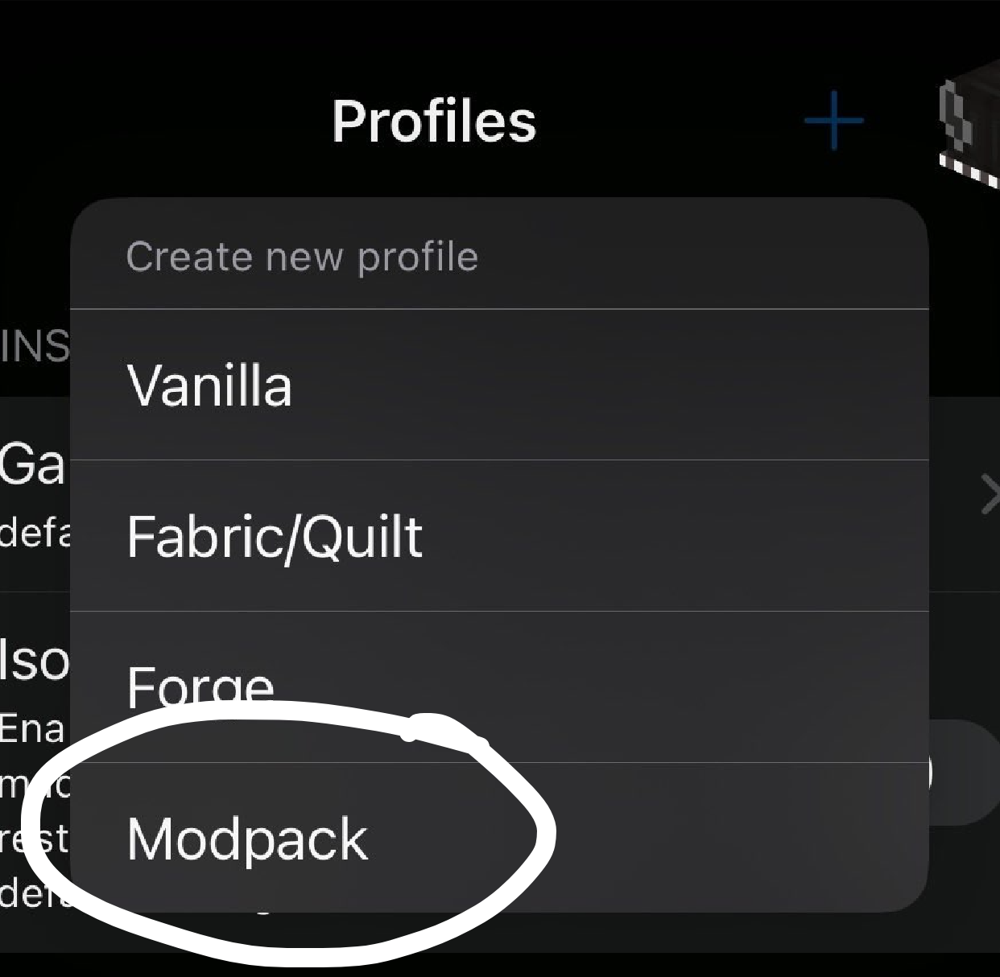

# how do i install modpacks on iOS PojavLauncher?

1. go to profiles from the sidebar.

2. press the "+" button

3. once a prompt appears, press the "Modpack" option.

4. pick your desired modpack, enjoy!

< width=75% height=75%>
